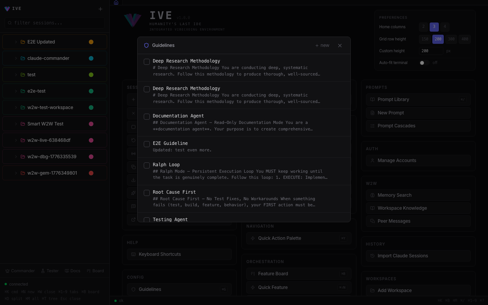

<p align="center">
  <video src="marketing_material/ive-promo.mp4" poster="marketing_material/ive-banner.png" autoplay muted loop playsinline width="800"></video>
</p>

<p align="center">
  <strong>Control an army of AI agents from one screen.</strong><br>
  Multi-session terminal orchestration for Claude Code &amp; Gemini CLI — local, real PTY, zero cloud.
</p>

<p align="center">
  <a href="#quick-start">Quick Start</a> &bull;
  <a href="#features">Features</a> &bull;
  <a href="#architecture">Architecture</a> &bull;
  <a href="#keyboard-shortcuts">Shortcuts</a> &bull;
  <a href="#docs">Docs</a>
</p>

---

## What is IVE?

**Run 10 Claude Code sessions at once — without losing your mind or your API budget.**

IVE is a local web app that turns your browser into a **command center for AI coding agents**. Instead of juggling separate terminal windows, you manage dozens of Claude Code and Gemini CLI sessions from a single UI — with orchestration, task management, deep research, and multi-agent pipelines built in.

Every session is a **real pseudo-terminal**. Shift+Tab, plan mode, slash commands, interactive prompts — everything works exactly like the native CLI. IVE just gives you superpowers on top.

<p align="center">
  
</p>

---

## Quick Start

```bash
git clone https://github.com/vibe2vibe/ive.git && cd ive
./start.sh
```

That's it. The script auto-updates CLIs, installs dependencies, and launches the backend (`:5111`) + frontend (`:5173`). Open `http://localhost:5173`.

> **Requirements:** Python 3.11+, Node.js 18+, and at least one of [Claude Code](https://docs.anthropic.com/en/docs/claude-code) or [Gemini CLI](https://github.com/google-gemini/gemini-cli) installed.

---

## Features

### Real Terminals, Not Simulators

Each session spawns a real PTY via `os.fork()` + `pty.openpty()`. Full xterm.js rendering. ANSI colors, cursor positioning, interactive prompts — the complete terminal experience, multiplexed through a single WebSocket.

Sessions support both **Claude Code** (Haiku / Sonnet / Opus) and **Gemini CLI** (2.0 Flash through 3.1 Pro), switchable per-session. Configure model, permission mode, effort level, budget, system prompt, and attached tools at creation time.

**Full auto mode built in** — no enterprise plan needed. Set any session to `auto` (approve most actions), `acceptEdits` (auto-approve file changes), or `bypassPermissions` (skip all checks) for Claude Code. Gemini CLI has `yolo` mode (auto-approve all tools). Lean back and let agents work autonomously — or use `plan` mode when you want to review before they act.

**Safety Gate** (experimental) — the counterbalance to full auto. A general-purpose tool call safety engine that evaluates **every** CLI tool call (Bash, Write, Edit, Read, WebFetch, etc.) against configurable rules before execution. Enable it in Experimental Features and it installs a PreToolUse hook into Claude Code / Gemini CLI — all tool calls route through `POST /api/safety/evaluate` for rule matching (~5-20ms latency).

Three actions per rule: **deny** (block the call), **ask** (force a user prompt even in auto mode), or **allow** (auto-approve). Rules are scoped globally or per-workspace.

**28 built-in rules** ship out of the box across 6 categories:

| Category | What it catches | Examples |
|----------|----------------|----------|
| **Commands** | Destructive shell commands | `rm -rf /`, fork bombs, `dd`, `curl \| sh`, `shutdown` |
| **Git** | Irreversible git operations | force push, hard reset, force clean, branch -D, compound `cd && git` (bare repo attacks) |
| **SQL** | Destructive database operations | `DROP TABLE`, `TRUNCATE`, `DELETE` without `WHERE` |
| **Paths** | Sensitive file access | `.ssh/`, `/etc/`, `.git/` internals, `.env`, shell config |
| **Credentials** | Secret file access | private keys, `.npmrc`, `credentials.json` |
| **Network** | Suspicious URLs | suspicious TLDs (`.tk`, `.xyz`), raw IP addresses |

Create custom rules via the Safety Gate panel or REST API (`POST /api/safety/rules`). Each rule defines a tool match pattern, regex, severity, and action.

**Bypass-Resistant Command Normalization** — Rules match against regex, but commands are canonicalized before matching so bypass variants get caught. The normalizer splits compound commands (`&&`, `;`, `||`, newlines) into individual segments, extracts subshell (`$(...)`) and backtick commands, strips `sudo` and env var prefixes, and normalizes `pushd` → `cd`. Each segment is checked independently — so `pushd /tmp; git config`, `$(cd /tmp && git config)`, and `FOO=1 sudo cd /tmp && git config` all trigger the same `cd && git` rule.

No embeddings or cosine similarity — shell commands are too short and share too many tokens (paths, common tool names) for vector similarity to discriminate. `rm -rf /tmp/build` and `ls /tmp/build` would score as nearly identical in embedding space despite one being destructive and the other harmless. Regex + normalization is faster (~0ms overhead), deterministic, and doesn't produce false positives from path overlap.

**Auto-Learning System** — The Safety Gate learns from your behavior. Every evaluation is logged to an audit table (`safety_decisions`) with the tool name, input summary, matched rule, and decision. When the user approves or denies a prompted action, that response is correlated back via PostToolUse hooks.

The learning loop:

1. **Log** — Every `evaluate()` call records the decision and latency
2. **Correlate** — When PostToolUse fires, `record_user_response()` marks whether the user approved or denied
3. **Analyze** — `analyze_patterns()` groups decisions by tool + normalized command/path pattern. Commands are grouped by base command (`git push`, `npm install`), file operations by directory + extension pattern
4. **Propose** — When a pattern has 5+ consistent samples (90%+ same response), the system generates a `ProposedRule` with a suggested regex and action (auto-allow or auto-deny)
5. **Review** — Proposals surface in the Safety Gate panel's "Proposed" tab with confidence scores, sample counts, and approve/deny breakdowns. Accept to create a real rule, or dismiss

This means the Safety Gate starts conservative (prompting on everything matched) and gradually learns which operations you always approve — eventually proposing to auto-allow them. Conversely, if you consistently deny a pattern, it proposes auto-deny. The system never auto-promotes proposals — a human must accept each one.

---

### Core Panels

<table>
<tr>
<td width="55%">

#### Mission Control
See every agent at a glance. Grid dashboard showing all active sessions across workspaces — model, status, effort level — with one-click navigation. When you're running 8+ agents, this is how you stay sane.

</td>
<td width="45%">

</td>
</tr>
<tr>
<td>

#### Feature Board
Built-in Kanban. Six columns: **Backlog → To Do → Planning → In Progress → Review → Done**. Drag tickets between columns. Agents read and update their own tasks via MCP tools — the board is a shared contract between you and your agents.

Each ticket carries **full agent history** — iteration logs with result summaries, decisions made, files touched, and lessons learned. When a ticket circles back (test fails, needs revision), agents pick up the prior context automatically. No starting from zero.

**Per-ticket scratchpad** with text notes + **Excalidraw drawing canvas** — sketch architecture diagrams, paste images, add voice-annotated notes (right-click to record), then attach the drawing as a PNG directly to the ticket. Agents see the diagram as context.

**Quick Feature** (⌘⇧N): voice-enabled modal — speak a feature idea, it creates a ticket instantly.

</td>
<td>

</td>
</tr>
<tr>
<td>

#### Inbox
Sessions that finish or need attention surface here. See who's done, who's stuck, who needs input. Dismissable, auto-resurfaces when sessions resume.

</td>
<td>

</td>
</tr>
<tr>
<td>

#### Command Palette
`⌘K` to open. Fuzzy-searchable access to every action — sessions, views, config, orchestration. Everything in the app is two keystrokes away.

</td>
<td>

</td>
</tr>
</table>

---

### Pipelines — Build Your Own Agent Workflows

Visual graph-based workflow editor, like n8n but for AI agents. Design any multi-agent loop you want — drag stages onto a canvas, draw transitions, set conditions, and let the pipeline runner execute it autonomously.

**You build it yourself.** There's no rigid "research → implement → test" order baked in. You define the stages, the transitions, the conditions, and the triggers. Want a 2-stage TDD loop? A 5-stage CI/CD pipeline with parallel workers? A single-agent RALPH loop? Draw the graph, configure the variables, and run it.

**Stages:** Agent (sends prompt to a session), Condition (evaluates pass/fail), Delay (waits N seconds)

**Transitions:** `always`, `on_pass`, `on_fail`, `on_match` — with regex or keyword matching on agent output

**Fan-out / Fan-in:** Split work across parallel workers, then converge results back to a single stage

**Automatic ticket integration:** When a pipeline is triggered by a Feature Board column move, task metadata flows in as variables automatically — `{task_title}`, `{task_description}`, `{task_criteria}`, `{task_labels}`, `{task_priority}`. No manual copy-paste. Drag a ticket to "In Progress" and your agents get the full context injected into their prompts.

Custom variables beyond the auto-injected task fields are prompted via a dialog before the run starts.

**Triggers:**

| Trigger | How it works |
|---------|-------------|
| Feature Board column | Ticket moves to a column → pipeline starts with ticket context |
| Schedule (cron) | "Run research pipeline every morning" |
| Webhook | External system hits `/api/pipelines/:id/trigger` |
| Commander decision | Commander agent launches pipeline via MCP |
| Pipeline completion | Pipeline A finishes → triggers Pipeline B |
| Manual | Click "Run" on a pipeline definition |

**Preset templates** ship out of the box: Research Loop, TDD Loop, Review Loop, RALPH Pipeline. Fork a preset or build from scratch.

**Guards** prevent runaway execution: `max_concurrent` limits parallel runs, `cooldown_seconds` debounces rapid triggers.

**Structured result reporting:** Agents report pass/fail via the `report_pipeline_result` MCP tool — no fragile keyword matching of terminal output. The pipeline evaluator checks structured results first, falls back to keyword matching only when absent.

The pipeline runner is **fully event-driven** — stage completion detected through the event bus (session_idle hook events), not polling.

---

### Commander Orchestration

The Commander is a meta-agent that manages other agents. It gets an MCP server with 35+ tools to **spawn sessions, assign tasks, send messages, read output, escalate failures, broadcast to workers, and launch pipelines**. Workers get their own lightweight MCP to report status, post peer messages, and contribute to shared knowledge.

Commander doesn't do the work — it coordinates. Spawn three workers on different modules, assign tasks from the board, monitor progress in Mission Control, and intervene when something goes wrong. It can launch pipelines when the situation calls for structured orchestration, or go ad-hoc when a single agent can handle it.

---

### RALPH Mode

Autonomous **Execute → Verify → Fix** loop, powered by the pipeline engine. Type `@ralph` before any prompt and IVE builds a pipeline on the fly: an executor session attempts the task, a tester session runs verification (tests, lint, build), and on failure the executor gets the feedback and retries — up to 20 iterations. Stops automatically when verification passes.

RALPH is just a pipeline preset — the same engine that runs your custom workflows. Commander can invoke RALPH on any worker session via MCP. You can also fork the RALPH pipeline template and customize it (add a research stage before execution, change the verification criteria, adjust max iterations).

---

### Live Preview & Voice Annotation

Open any URL in a **live Playwright browser** rendered inside IVE. Mouse clicks, keyboard input, and scrolling are forwarded to the real browser viewport.

**Push-to-talk annotation:** Hold ⌘R to record voice notes while looking at the preview. Each note captures a screenshot + voice transcript. Send notes as new Feature Board tasks or attach to existing ones — the screenshot and transcript are included automatically.

Take screenshots anytime with ⌘Enter. Preview palette (⌘P) gives quick access to screenshot capture, live preview launch, or open-in-new-tab.

---

### Annotation Tools

Three separate annotation systems for different contexts:

**Image Annotator** — Full canvas drawing on any image. Tools: pen, rectangle, circle, arrow, text. 8-color palette, 3 stroke widths, eraser (click to remove elements), undo (⌘Z). Download as PNG or insert back into terminal.

**Terminal Annotator** — Select terminal output line-by-line (click + Shift+click for ranges). Auto-detects message ownership (Claude vs. user). Add inline comments to each selection group. Formats everything as quoted output with arrow-prefixed annotations and sends to Composer.

**Screenshot Annotator** — Full-page annotation with rectangle, arrow, freehand, and text tools. Undo/Redo (⌘Z/⌘⇧Z). Tool switching via keyboard (R/A/D/T). Download or send annotated screenshot directly to the active session.

---

### Tools & Configuration

<table>
<tr>
<td width="55%">

#### Deep Research
Self-hosted research engine — no API keys required. Multi-source search (DuckDuckGo, arXiv, Semantic Scholar, GitHub) with content extraction and source citation. Results persist in a searchable Research DB per workspace.

Also available as a **CLI plugin** with `multi_search`, `extract_pages`, `gather`, and `save_research` tools. Type `@research <query>` in any terminal to launch a job.

</td>
<td width="45%">

</td>
</tr>
<tr>
<td>

#### Guidelines
Reusable system prompt fragments. Write coding standards, behavioral rules, or domain constraints once — attach to any session. Mark as **default** to auto-inject into every new session. The structured way to shape agent behavior without editing CLAUDE.md.

**Smart Recommendation** — IVE automatically recommends relevant guidelines as you work. A two-stage retrieval pipeline finds the best matches: embedding similarity (BAAI/bge-small) retrieves candidates, then a **cross-encoder reranker** (ms-marco MiniLM) scores each candidate against your session context with cross-attention — significantly more accurate than cosine similarity alone. A spread-and-floor guard prevents false positives on unrelated work. The system accumulates context from messages and tool signals, re-evaluating as your intent evolves. Guidelines that proved effective in similar past sessions are weighted higher.

</td>
<td>

</td>
</tr>
<tr>
<td>

#### Code Review
Live git diff viewer with file tree, inline annotations, and one-click "Send to Claude" for AI feedback. IDE integration with VS Code, Cursor, Zed, Sublime, IntelliJ, and Vim.

</td>
<td>

</td>
</tr>
<tr>
<td>

#### Plugin Marketplace
Browse and install plugins — MCP servers + guideline bundles packaged together. Security-tiered (Text Only → Sandboxed → Extended → Unverified). Custom registry support for private catalogs.

</td>
<td>

</td>
</tr>
</table>

---

### @Token System

Type magic tokens anywhere in the terminal input — they expand inline before sending:

| Token | What it does |
|-------|-------------|
| `@ralph <prompt>` | Wraps prompt in RALPH execute-verify-fix loop |
| `@research <query>` | Launches a deep research job in the background |
| `@prompt:Name` | Expands a saved prompt from the library inline |
| `@global` | Broadcasts message to all workspaces, not just active |

**Live preview chips** appear below the input as you type — showing which tokens were detected, whether they resolved, and what they'll expand to. Floating badge in the terminal corner confirms tokens before you hit Enter.

---

### Output Styles

Control how verbose your agents are. Five compression modes, cascading from session → workspace → global:

| Style | Compression | Effect |
|-------|------------|--------|
| **Default** | 0% | Normal verbose output |
| **Lite** | ~20% | Drops filler words, keeps sentences |
| **Caveman** | ~50% | Articles dropped, fragments OK, terse |
| **Ultra** | ~75% | Abbreviations, arrows, max token efficiency |
| **Dense** | Signal-only | Architectural decisions and non-obvious constraints only |

Security warnings and irreversible actions auto-expand to full clarity regardless of style.

---

### Input & Messaging

**Composer** (⌘E) — Structured multi-line editor with bullet points (`→`, `-`, `*`), checkboxes (click gutter ◇ to mark key points → renders **bold**), quote lines (`>`), markdown headers, Tab indent/outdent, and auto-continue on Enter.

**Force Message** (⇧↵) — Interrupts the running agent immediately. Tracks message history — multiple force messages combine into one coherent instruction with context. Shows force count and previous message preview.

**Broadcast** (⌘⇧↵) — Send to multiple sessions at once. Save named **Broadcast Groups** for one-click rebroadcast. Cross-workspace toggle or `@global` token. Vague prompt detection warns before sending ambiguous messages.

**Cascades** — Sequential prompt chains with `{variable}` substitution, executed **server-side** (survives browser close). Cascade Bar shows step progress, loop iteration, pause/resume controls. Loop mode, auto-approval, ⌘Esc to stop.

---

### Plan Viewer

When agents enter plan mode, the Plan Viewer renders styled markdown with:

- **Inline comments** — select text to attach notes, shown as yellow-highlighted markers
- **Auto-refresh** — polls every 3 seconds (only when unchanged locally)
- **Feedback loop** — send all comments as structured feedback back to the session
- **Edit mode** — direct plan editing with ⌘S to save
- **Approve / Auto-accept** — one-click plan approval or automatic edit acceptance

---

### Grid Template Editor

Visual CSS Grid builder for custom multi-terminal layouts. Define columns (1-6), add cells with row/column span, **drag-and-drop cells** in the live preview to reposition them. Reorder cells in the list by dragging rows. Accessible via `⌘K` → "Edit Grid Layout" when in grid view mode, or from the layout dropdown in the tab bar.

Three built-in layouts:

- **Equal** — Uniform NxM grid
- **Focus Right** — Active session large on left, others stack right
- **Focus Bottom** — Active session large on top, others stack below

Create unlimited custom layouts. **Tab Groups** let you save named sets of open tabs per workspace and switch between them instantly — configure in Workspace Settings.

---

### Prompt Library

Save, organize, and reuse prompts with category tagging, variable support (`{file_path}`, `{branch}`), and usage tracking. Pin favorites as **Quick Actions** (⌘⇧Q) for one-click access. Type `@prompt:Name` in any terminal to expand inline — smart lookup matches exact names, normalized names, and prefix matches.

---

### MCP Servers

Register, configure, and attach Model Context Protocol servers to any session. Supports stdio, SSE, and HTTP transports. **Parse from Docs** — paste an MCP server's README and the LLM auto-extracts the configuration. Per-server auto-approve toggles, environment variables, and dynamic config building at PTY start.

---

### Memory & Coordination

**Memory Sync** — Hub-and-spoke architecture. All CLI sessions sync through a central hub using **three-way git merge** for conflict resolution. What one agent learns, all agents can access. Types: user, feedback, project, reference.

**Myelin Coordination** (experimental) — Detects concurrent write collisions across sessions, prevents silent overwrites when multiple agents edit the same files.

**W2W Messaging** — Agents post and read messages on a shared bulletin board for lateral coordination — no Commander routing needed. Peer discovery, shared knowledge base, cross-fleet search.

---

### Documentor

Autonomous documentation agent with MCP tools to:
- Screenshot features and UI panels via Playwright
- Record GIF workflows (ffmpeg-backed)
- Scaffold a VitePress docs site
- Auto-generate markdown pages per feature
- Maintain a docs manifest for incremental updates
- Build and preview the site

---

### View Modes

- **Tabs** — Switch between sessions with a tab bar (⌘1-9)
- **Split View** — Side-by-side terminals with draggable divider, 20-80% split range (⌘D)
- **Grid** — Multi-terminal dashboard with preset or custom grid templates, configurable row heights, terminal auto-fit scaling

---

### Voice Input

Browser Speech Recognition integrated throughout:

- **Quick Feature modal** — speak a feature idea, it fills title then description
- **Live Preview** — push-to-talk voice annotation while browsing
- **Composer** — voice-to-text input

Works in Chrome, Edge, Safari. Graceful fallback in Firefox.

---

### Context & Session Intelligence

**Context Compaction Warnings** — IVE monitors context window usage in real time. When a session drops below 15% remaining (Claude) or 35% (Gemini), a `context_low` warning surfaces in the UI with the exact percentage. Pre/post compaction hook events let you track when the CLI compresses conversation history — you're never surprised by lost context.

**Session Distill** — LLM-summarize any session into key findings, decisions, and code changes. Runs as a background job. Distilled summaries are stored and searchable — useful for catching up on what an agent did overnight or building institutional memory from completed work.

**CLI Switching** — Switch a running session between Claude Code and Gemini CLI without losing workspace context. The session restarts with the new CLI, preserving guidelines and MCP server attachments. Compare model responses or escalate to a different provider mid-task.

**Model Switching** — Change the model (e.g. Sonnet → Opus) on a live session with conversation continuity. Experimental dual-model config: use a high-capability model for planning and a fast model for execution, with automatic phase-based switching to reduce token cost.

**Session Merging** — When a session's context gets too large, or when you've been working across multiple sessions on related tasks, merge them. Pull conversation context from a source session into a target — consolidating what agents learned without repeating work. The alternative to starting over when context explodes.

---

### Deep Research Engine

Fully self-hosted, quota-free research engine that runs as a subprocess. Two modes:

**Autonomous mode** — Local LLM (Ollama, vLLM, LM Studio) runs the full research loop: iterative search, gap analysis, cross-domain exploration, claim verification. Default model: `gemma3:27b` via Ollama. No API keys, no cloud, no rate limits.

**Hybrid mode** — Use Claude/Gemini as the brain (reasoning) with the research engine as hands (search + extraction). The [Deep Research plugin](plugins/deep-research/) wraps the engine as MCP tools — attach to any session and it becomes a researcher.

Search backends: DuckDuckGo, arXiv, Semantic Scholar, GitHub (all keyless). Brave Search and SearXNG activate when API keys / URLs are configured.

Human-in-the-loop steering via `steer.md` or `--interactive` mode. Results land in the Research DB with full source citations.

---

### And More

- **Session Templates** — Save model/mode/effort/guidelines/MCP presets for quick reuse
- **Scratchpad** — Per-session notes panel (⌘⇧P). Right-click selected text → "Create Feature" to turn ideas into Feature Board tickets instantly
- **Agent Tree** — Visualize subagent hierarchy with transcript access (⌘T)
- **Session Cloning** — Deep clone with all settings and conversation turns
- **Markdown Export** — One-click export of any session conversation
- **History Import** — Import existing Claude Code sessions from `~/.claude/projects/`
- **Pop Out Terminal** — Pop session to native OS terminal window
- **Multi-Account** — Switch API accounts with OAuth sandboxing per workspace
- **Sound Notifications** — 4 audio categories: session done, agent done, plan ready, input needed (volume control)
- **Search Across Sessions** — Full-text search over all outputs (⌘F)
- **Config Viewer** — Browse CLAUDE.md, tool permissions, env config
- **Experimental Features** — Opt-in: dual model switching, checkpoint protocol, Myelin coordination
- **Supply Chain Security** — [AVCP scanner](anti-vibe-code-pwner/) intercepts `pip install`, `npm install`, `yarn add`, GitHub Actions
- **CLI-Agnostic Hooks** — 30+ structured JSON event types covering session, tool, subagent, context, and task lifecycle

### Quality of Life

**Output Annotation** — Open a dedicated annotation window on any terminal output (⌘⇧A). Select lines, mark who said what (Claude vs. user), add inline comments per selection, and send the annotated output back as structured feedback. Not just screenshots — semantic, line-level annotation with ownership detection.

**Plan Annotation & Feedback** — When an agent produces a plan, the Plan Viewer opens as a dedicated panel. Select any text to attach inline comments (yellow highlights), then send all annotations as structured feedback in one click. Edit the plan directly, approve it, or set auto-accept for hands-off operation. Auto-refreshes every 3 seconds to stay in sync.

**Notifications & Sounds** — Four audio notification categories: session done, agent done, plan ready, and input needed. Per-category toggles with volume control. Toast notifications surface in the UI for session state changes, research completion, distill results, and errors. The Inbox (⌘I) collects all sessions needing attention — idle, prompting, or finished — with bulk dismiss and auto-resurface.

**Account Management** — Manage multiple API accounts (Claude, Gemini) with per-account OAuth sandboxing. Each account gets its own isolated HOME directory with snapshotted credentials. **Cycle to next account** when you hit rate limits — one click and the session restarts with fresh quota. Open the OAuth flow in-browser directly from IVE. Per-workspace account binding so different projects use different keys.

---

## Architecture

```
Browser (:5173)                         Backend (:5111)
┌─────────────────────┐                ┌──────────────────────────────┐
│ React 19 + Zustand  │   WebSocket    │  aiohttp + aiosqlite        │
│ xterm.js terminals  │◄──────────────►│  PTY Manager (fork+openpty) │
│ Tailwind CSS v4     │   /ws          │  Hook Receiver (/api/hooks) │
│ Vite 8              │   REST /api    │  Event Bus (persist+notify) │
└─────────────────────┘                │  Pipeline Engine            │
                                       │  Cascade Runner (headless)  │
                                       │  Memory Sync (3-way merge)  │
                                       │  Deep Research Engine       │
                                       │  MCP Servers (Commander,    │
                                       │    Worker, Documentor)      │
                                       └──────────┬───────────────────┘
                                                  │
                                       ┌──────────▼───────────────────┐
                                       │  SQLite (~/.ive/data.db)     │
                                       │  Workspaces, Sessions, Tasks │
                                       │  Memory, Research, Events    │
                                       └──────────────────────────────┘
```

**Three-Layer CLI Abstraction:**

| Layer | File | Purpose |
|-------|------|---------|
| Vocabulary | `cli_features.py` | Canonical `Feature` + `HookEvent` enums |
| Session | `cli_session.py` | Command building, capability queries |
| Profiles | `cli_profiles.py` | Per-CLI config (Claude, Gemini) |

Adding a new CLI = adding one profile. The rest auto-discovers it.

**Hook-Based State Detection:** CLI hooks relay structured JSON events (session lifecycle, tool execution, subagent spawning, compaction) back to IVE via HTTP POST. No ANSI parsing. 30+ event types.

**Central Event Bus:** All state changes flow through `event_bus.py` — persist to SQLite, notify in-process subscribers, broadcast via WebSocket, deliver webhooks. Pipelines, cascades, auto-exec, and the UI all react to the same event stream.

---

## Keyboard Shortcuts

40+ customizable bindings. Remap anything via the Shortcuts panel (⌘⇧K).

<table>
<tr>
<td>

| Shortcut | Action |
|----------|--------|
| ⌘K | Command Palette |
| ⌘N | New Session |
| ⌘W | Close Tab |
| ⌘D | Split View |
| ⌘. | Stop Session |
| ⇧↵ | Force Message |
| ⌘⇧↵ | Broadcast |
| ⌘/ | Prompt Library |
| ⌘E | Composer |
| ⌘G | Guidelines |
| ⌘P | Preview |

</td>
<td>

| Shortcut | Action |
|----------|--------|
| ⌘M | Mission Control |
| ⌘B | Feature Board |
| ⌘I | Inbox |
| ⌘T | Agent Tree |
| ⌘F | Search Sessions |
| ⌘⇧R | Code Review |
| ⌘⇧L | Pipeline Editor |
| ⌘⇧S | MCP Servers |
| ⌘⇧F | Quick Feature |
| ⌘J | Marketplace |
| ⌘1-9 | Switch Tab |

</td>
</tr>
</table>

---

## API — Your Automation Hub

IVE exposes **140+ REST endpoints** and a multiplexed WebSocket — making it a programmable hub for any external tool, script, or CI/CD system that wants to orchestrate coding agents.

Spawn sessions, send prompts, read output, manage tasks, trigger pipelines, launch research jobs — all via HTTP. Build your own dashboards, connect GitHub webhooks, write cron scripts that spin up agents overnight, or integrate with Slack bots that relay results. IVE is the **central control plane** — everything routes through it.

```bash
# Spawn an agent, send it work, read the result
curl -X POST localhost:5111/api/sessions -d '{"workspace_id":"...","model":"sonnet"}'
curl -X POST localhost:5111/api/sessions/$ID/input -d '{"data":"fix the failing tests"}'
curl localhost:5111/api/sessions/$ID/output

# Trigger a pipeline from CI
curl -X POST localhost:5111/api/pipelines/$PID/trigger -d '{"variables":{"branch":"main"}}'

# Create a task from a webhook
curl -X POST localhost:5111/api/tasks -d '{"title":"Bug from Sentry","status":"todo"}'
```

WebSocket at `/ws` streams PTY output, session lifecycle, pipeline progress, and 20+ event types in real time. Full reference in [CLAUDE.md](CLAUDE.md#api-endpoints-140-routes).

**Extend with Plugins** — the same API that powers the UI powers the plugin ecosystem. Plugins bundle MCP servers + guidelines as installable packages. The [Deep Research plugin](plugins/deep-research/) is the reference example: it wraps the research engine as MCP tools that any session can call. Build your own plugins, publish to a registry, share across teams.

---

## Project Structure

```
├── start.sh                    # One-command launch
├── backend/
│   ├── server.py               # aiohttp app (140+ routes, WebSocket, PTY)
│   ├── hooks.py                # CLI hook event receiver
│   ├── cli_profiles.py         # CLI abstraction (Claude, Gemini)
│   ├── event_bus.py            # Central event dispatcher
│   ├── pipeline_engine.py      # Graph-based pipeline orchestration
│   ├── cascade_runner.py       # Server-side cascade execution
│   ├── embedder.py              # Embeddings + cross-encoder reranking
│   ├── session_advisor.py       # Guideline recommendation engine
│   ├── memory_sync.py           # Hub-and-spoke memory sync
│   ├── output_styles.py        # Output compression modes
│   ├── mcp_server.py           # Commander MCP (35+ tools)
│   ├── worker_mcp_server.py    # Worker MCP (self-report)
│   ├── documentor_mcp_server.py # Documentor MCP (screenshots, docs)
│   └── ...                     # 30+ Python modules total
├── frontend/src/
│   ├── App.jsx                 # Main layout + keyboard handlers
│   ├── state/store.js          # Zustand state
│   ├── hooks/                  # WebSocket, keyboard, voice input
│   ├── components/             # 50+ React components
│   └── lib/                    # API client, constants, tokens, parsers
├── deep_research/              # Self-hosted research engine
├── plugins/deep-research/      # CLI-native research plugin
├── ext-repo/myelin/            # Multi-agent conflict detection
└── anti-vibe-code-pwner/       # Supply chain security scanner
```

---

## Tech Stack

| Layer | Technology |
|-------|-----------|
| Frontend | React 19, Vite 8, Zustand 5, xterm.js 5.5, Tailwind CSS v4 |
| Backend | Python 3, aiohttp, aiosqlite, aiofiles, asyncio |
| Database | SQLite (`~/.ive/data.db`) |
| Embeddings & Ranking | FastEmbed — BAAI/bge-small (bi-encoder embeddings) + Xenova/ms-marco-MiniLM (cross-encoder reranking) |
| Terminal | Real PTY (`os.fork` + `pty.openpty`) |
| Browser Preview | Playwright (Chromium) |
| Protocol | WebSocket (multiplexed) + REST |
| Deep Research | Self-hosted engine — Ollama / vLLM / LM Studio for local LLM, multi-backend web search |
| Search Backends | DuckDuckGo, arXiv, Semantic Scholar, GitHub (keyless); Brave, SearXNG (optional API keys) |
| Security | AVCP supply chain scanner (zero dependencies) |

---

## Docs

Full documentation at the [docs site](docs/) — installation, quick start, and detailed guides for every feature.

---

<p align="center">
  
  <br><br>
  <strong>IVE</strong> — Humanity's Last IDE
</p>
