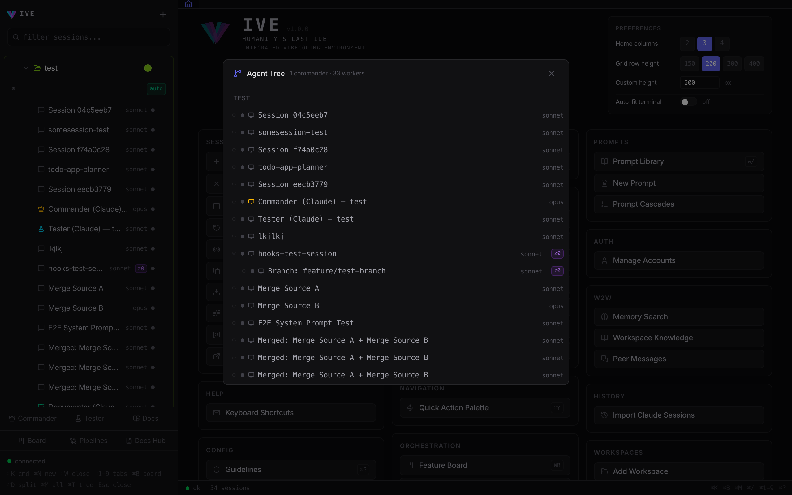

<p align="center">
  
</p>

<h1 align="center">IVE</h1>

<h3 align="center">Vibecoding on steroids. Humanity's last IDE.</h3>

<p align="center">
  <em>One browser. N terminals. Infinite agents. Bring friends.</em><br>
  <strong>CLI-agnostic · Multiplayer · Skills-extensible · Memory + intelligence built in</strong>
</p>

<p align="center">
  <a href="https://github.com/vibe2vibe/ive/blob/main/LICENSE"></a>
  
  
  
  
  
</p>

<p align="center">
  <a href="#-quick-start"><strong>Quick start</strong></a> ·
  <a href="#-what-you-get"><strong>5 pillars</strong></a> ·
  <a href="#-marquee-features"><strong>Marquee</strong></a> ·
  <a href="#-the-full-toolkit"><strong>Full toolkit</strong></a> ·
  <a href="#-why-ive-exists"><strong>Why IVE</strong></a> ·
  <a href="#%EF%B8%8F-under-the-hood"><strong>Architecture</strong></a> ·
  <a href="#%EF%B8%8F-this-is-alpha"><strong>Roadmap</strong></a>
</p>

<p align="center">
  <a href="https://app.supademo.com/demo/cmoitisch007uw80jl478lo8u">
    
  </a>
</p>
<p align="center">
  <a href="https://app.supademo.com/demo/cmoitisch007uw80jl478lo8u"><strong>▶ Take the 9-step interactive tour</strong></a>
  <br><sub>The IVE main layout — workspaces and sessions on the left, every action one click away.</sub>
</p>

<br>

<table>
<tr>
<td align="center" width="33%">

<br><sub><b>⌘K</b> — every action, searchable</sub>
</td>
<td align="center" width="33%">

<br><sub><b>Feature Board</b> — pipeline auto-dispatch on column move</sub>
</td>
<td align="center" width="33%">

<br><sub><b>Marketplace</b> — 8000+ skills, one-click install</sub>
</td>
</tr>
</table>

---

## 🔥 The pitch

Six terminals already running. Three Claude Code, two Gemini, one Commander session managing workers. A friend jumps in from their phone and starts triaging the Feature Board. A pipeline fires the second a ticket hits *In Progress*. Sonnet runs out mid-sentence — IVE grabs the next plan and keeps going. You go get coffee. Nothing stops.

IVE is local and open. Your CLIs, your accounts, your machine. Stack Claude Max + Gemini Ultra + API keys and IVE rotates through them when a quota empties. Invite a collaborator with a four-word passcode, clamp them to read-only or code-only, put the laptop in the bag.

## 🚀 Quick start

```bash
git clone https://github.com/vibe2vibe/ive.git
cd ive
./start.sh
```

Open <http://localhost:5173>. That's it. `start.sh` updates the CLIs, installs everything, pre-fetches Playwright + embedding weights, and launches the backend (`:5111`) and frontend (`:5173`). First run pulls the network; every run after is offline-friendly.

**Don't want to clone?** `npx ive --tunnel` boots a public-tunneled instance you can reach from any device.

Full prerequisites in [`INSTALL.md`](INSTALL.md).

## 📦 What you get

Five promises. Real receipts behind each.

### 1. CLI-agnostic
> Claude Code, Gemini CLI, anything that ships next. One UI, one mental model.

Three-layer abstraction (`cli_features.py` → `cli_session.py` → `cli_profiles.py`) — adding a new CLI means adding one profile. Real PTY (`os.fork()` + `pty.openpty()`) means Shift+Tab, plan mode, slash commands, interactive prompts — everything works exactly like native.

<p align="center">
  
</p>
<p align="center"><sub>Mission Control (⌘M) — every live session across all workspaces in one grid.</sub></p>

### 2. Multiplayer
> Invite collaborators with one click. Clamp them to Brief / Code / Full. No shared admin password.

One-shot invites with EFF-wordlist or QR. Per-row joiner sessions with sliding TTL. Three modes enforced at route, CLI-flag, and hook layer. PWA + Web Push so a teammate can triage from the couch.

### 3. Skills + extensible
> Plugins, MCP servers, guidelines, output styles, skills — attach per session, swap on the fly.

Plugin Marketplace with registry sync. 8000+ skill catalog baked in. MCP servers for Commander, Worker, and Documentor. `@prompt:` / `@research:` / `@ralph` token expansion inline.

### 4. Memory + intelligence built in
> Hub-and-spoke sync, three-way merge, briefings, an LLM router that uses *your* CLI subscription — no API keys.

Memory entries scoped per-workspace with auto-import on file change. `/api/catchup` builds a 2-5 sentence prose briefing from event bus + git log + memory hub. Stale-session banner auto-loads if you've been gone >30 min.

### 5. Quality-of-life everywhere
> All the things you wished your terminal had — already inside.

Pipelines (visual graph editor) · Feature Board Kanban · Deep Research engine · Mission Control · Code Review · Full-text search across sessions · Live Preview + screenshot annotator · Voice quick-feature drop · Per-terminal scratchpads · 30+ configurable hotkeys · RALPH execute→verify→fix loops · Output Styles for token savings · Mobile-first PWA + Web Push.

<p align="center">
  
</p>
<p align="center"><sub>⌘T — Agent Tree: every sub-agent spawned, with model, status, and full transcript.</sub></p>

## 🎯 What changes the moment you install

> The features above are means. These are the ends.

🛑 **Your terminals stop being archaeology.** Every session lives in one grid — state, scroll, name, ownership all tracked. No more *"which window had the auth fix?"*

🛑 **Your tokens stop running out.** Stack every plan you own — Claude Max, Gemini Ultra, API keys. IVE rotates on `quota_exceeded` automatically. You don't notice. The agent doesn't notice. The PR ships.

🛑 **Your laptop stops being a leash.** Add IVE to your phone's home screen. Same agents, same memory, same hotkeys. Code while you're in line for coffee. Triage from the couch. Snack run ≠ context loss.

🛑 **Your team stops needing the keys.** Hand a friend a 4-word invite. They get **Brief / Code / Full** mode — clamped at three layers. No screen sharing. No password reset. No trust fall.

🛑 **Your roadmap stops being yours alone.** Observatory scans the AI ecosystem 24/7 and tells you what to integrate or steal. While you sleep, your project gets smarter.

🛑 **Your context stops getting lost.** Catch-up briefings tell you what your agents (and your collaborators) did while you were gone. In prose. In two clicks.

The vibecoding tax — tab-hunting, manual merging, quota walls, "send me your screen" — **gone.**

## 💡 Why IVE exists

**I was annoyed.**

You're at a hackathon, or shipping fast at a startup, and suddenly there are six terminals open. Code is being pushed faster than you can `git pull`. You're merging, re-syncing, sometimes building the same thing twice in two different windows because nobody knew. You're burning cycles remembering *which* terminal had *which* context. Annotating output, planning, jumping between tasks — all tedious in a stock CLI.

The "solutions" out there? Antigravity, Codex — proprietary boxes. Cursor hasn't moved past the autocomplete era. Nobody's pioneering. So I built the thing I wanted: a paradigm shift, in the open, like the early days.

With IVE you grab a snack at a party and keep coding from your phone — same sessions, same agents, same memory. Stop wasting time. **Spend tokens.** Build your startup before the night's over.

**And never stop coding.** Stack Claude Max plans, Gemini Ultra subs, API accounts — IVE rotates through them automatically when one quota empties, swaps models or accounts *mid-session*, and pools the whole stack across friends working on one project or twenty. Quota-exceeded is a UX problem, not a hard stop.

## 👥 Who it's for

- **Hackathon teams** who need to ship in 36 hours and stop stepping on each other.
- **Solo founders & startup teams** — your product, engineered on autopilot, hands-on, or any blend you dial in. Multiplayer when you bring a co-builder, single-player when you want flow. Every knob configurable. Outpace teams 5× your size.
- **Power users** who already pay for Claude Max + Gemini Ultra and want every token to count.
- **Anyone** who looked at a closed-source AI IDE and thought *"this should be open."*

## ✨ Marquee features

A handful of things IVE does that nothing else in the space does — or at least not all in one place.

### 🔭 Observatory — autonomous AI ecosystem scanner
IVE runs a background scanner across **GitHub Trending · Product Hunt · Hacker News · Reddit · X/Twitter** on configurable intervals (12–24 h). Each source has two modes you can toggle independently — **"integrate"** (find tools/libs worth adding to *this* workspace) and **"steal"** (find features other tools have that yours should adopt). Findings are LLM-scored for relevance to your codebase and routed to a dedicated **Observatorist** session type that gives concrete recommendations: what to install, what it replaces or augments, where in the code to apply it, estimated effort. Hit ⌘⇧O for the feed. Your project gets smarter while you sleep.

<p align="center">
  
</p>

### 🌊 Pipelines — visual multi-agent workflows
Drag-and-drop node-graph editor for orchestrating Commander, workers, and testers. **Agent · Condition · Delay** stages connect via `always` / `on_pass` / `on_fail` / `on_match` transitions. Triggers fire from a Feature Board column move, another pipeline completing, or manually. Variables auto-inject from the triggering task (`{task_title}`, `{task_criteria}`, `{topic}`, `{task_labels}` …). Custom `{vars}` prompt a dialog before run. Four presets ship in the box: **Research Loop · TDD Loop · Review Loop · RALPH**. The worker MCP exposes `report_pipeline_result` so stages report **structured pass/fail** instead of keyword-matching terminal output. Guards like `max_concurrent` and `cooldown_seconds` keep runaway loops in check.

### 📱 Mobile + PWA — code from the couch
Add-to-Home-Screen on iOS and Android (manifest + service worker shipped). **Web Push** via VAPID for off-screen alerts when an agent stalls or a pipeline finishes. Network-first for `/api/*` (never cached), cache-first for the app shell. Pair with `npx ive --tunnel` (Cloudflare-tunnel mode) and you've got a full xterm in your pocket — same sessions, same agents, same memory. Snack break, party run, train ride — context never breaks.

### 📋 Catch-up briefings — "while you were away"
Step away for an hour. Step back. IVE writes you a **2–5 sentence prose digest** of what happened — agent activity, git commits, memory changes — by fusing the event bus, `git log`, and the memory hub through a small LLM (Haiku by default, swap to Sonnet with a click). The `CatchUpBanner` auto-loads at the top of the app when you've been idle > 30 min. Preset ranges (1 h / 8 h / 24 h / 7 d / 30 d) or a custom datetime-local window. Mode-aware filtering for Brief joiners (they only see the events their mode lets them care about).

<p align="center">
  
</p>
<p align="center"><sub>⌘I — Inbox: every idle or prompting session, one click away.</sub></p>

### 🔍 Code Review — git diff next to your terminals
A first-class diff viewer with file tree on the left, unified diff with syntax highlighting in the middle, full-text search across hunks, and inline annotation. One click to open any file in your IDE. Drives the **Review Loop** pipeline preset directly. ⌘⇧G opens it.

### 📓 Scratchpads — three layers, all auto-persisted
**Global** ⌘J scratchpad for free-floating notes. **Per-session** scratchpad that travels with each terminal — your context for that agent stays attached to that agent. **Per-task Excalidraw** drawing surface inside every Feature Board ticket so you can sketch architecture next to the description. Plus a **Quick Feature drop** modal (⌘⇧N) with optional voice input — speak a feature into existence while your hands are full of agents.

## 🎒 The full toolkit

The 5 pillars above are the elevator pitch. Here's the inventory.

### 🖥️ Sessions & terminals
- Real PTY for **Claude (Haiku / Sonnet / Opus)** + **Gemini CLI** — Shift+Tab, plan mode, slash commands, interactive prompts all work natively
- 1 MB rolling output cache → instant replay on tab remount or grid switch (no PTY restart, no blank xterm)
- Per-session config: model · permission mode · effort · budget · system prompt · tools · account · worktree
- Switch CLI **mid-session**, switch model with resume, restart with a different account on the fly
- Clone · merge · distill (LLM-summarize) · export to markdown/JSON
- `@prompt:` / `@research:` / `@ralph` token expansion inline as you type
- Composer for structured multi-line input · Force-bar for `Shift+Enter` interrupts
- Broadcast input to many sessions; named broadcast groups
- Mission Control dashboard · Inbox of idle/pending sessions · Sub-agent tree with full transcripts

### 🤖 Agent orchestration
- **Commander** (opus / plan / high) — orchestrates worker sessions over MCP
- **Tester** — verifies via the worker MCP's structured `report_pipeline_result`
- **Documentor** — Playwright screenshots + ffmpeg GIFs + auto-built **VitePress docs site**
- **Worker MCP** — scoped session tools (read/update own tasks, transitions)
- **RALPH** — execute → verify → fix loop, up to 20 iterations, with task-aware exit
- **Pipelines** — visual node-graph editor; Agent / Condition / Delay stages; `always` / `on_pass` / `on_fail` / `on_match` transitions; triggers on `board_column` / `pipeline_complete` / `manual`; guards for `max_concurrent` + `cooldown_seconds`
- 4 built-in presets: **Research Loop · TDD Loop · Review Loop · RALPH**
- Auto-injected pipeline variables (`{task_title}`, `{topic}`, `{task_criteria}`, …); custom `{vars}` prompt a dialog
- Auto-exec from Feature Board column moves (yields to active pipelines)
- Multi-agent conflict detection via **myelin coordination** (experimental flag)

### 🧠 Knowledge, memory & research
- **Hub-and-spoke memory sync** with three-way `git merge-file` conflict resolution
- Workspace-scoped memory entries; globals stay global; auto-import on file change with live WS refresh
- Memory taxonomy: **user / feedback / project / reference**
- **Catch-up briefings** (`/api/catchup`) — event bus + git log + memory hub fused into a 2–5 sentence prose digest; Haiku or Sonnet, your pick
- Stale-session banner auto-loads when you've been gone > 30 min
- **Observatory** — autonomous scanner over GitHub Trending · Product Hunt · Hacker News · Reddit · X; "integrate" vs "steal" modes; LLM relevance scoring; dedicated Observatorist session type
- **Self-hosted Deep Research engine** — multi-backend (Brave · SearXNG · DuckDuckGo · arXiv · Semantic Scholar · GitHub), RRF-fused ranking, iterative gap analysis, hybrid mode (Claude/Gemini brain + local hands), human-in-loop via `steer.md`
- **Deep Research plugin** with 6 MCP tools: `multi_search` · `extract_pages` · `gather` · `save_research` · `get_research` · `finish_research`
- Distill any session into an LLM summary (background job) · Workspace Vision onboarding for new projects

### 👫 Collaboration & multiplayer
- One-shot **invites** in three projections of the same secret: 4-word EFF Long speakable · Crockford base32 compact (4-4-4) · base64url QR
- Three modes — **Brief** (read-mostly + advisory) · **Code** (auto/plan only, allowlisted Bash) · **Full** (owner-equivalent, TTL-bounded)
- Three enforcement layers: route guards · CLI flag injection at PTY start · hook-level tool denial
- Joiner sessions with sliding TTL + 90-day hard cap; one-round-trip revocation
- Mode pill in sidebar with logout
- Cloudflare-tunnel mode (`npx ive --tunnel`) with red-text security banner

### 📱 Mobile, PWA & push
- Add-to-Home-Screen on iOS + Android (manifest + service worker)
- Cache-first app shell, network-first for `/api/*` (never cached)
- **Web Push** via VAPID — opt-in; LAN-HTTP installs degrade gracefully to in-app banners
- Mobile install prompt with iOS instructions vs Android `beforeinstallprompt`
- Full xterm fidelity in your pocket — same shortcuts, same agents, same memory

<p align="center">
  
</p>
<p align="center"><sub>⌘⇧G — Code Review: unified diff, file tree, inline annotations, send range to any session.</sub></p>

### 🛠️ Workflow & day-to-day UX
- **Feature Board** Kanban (backlog → todo → planning → in_progress → review → done) with full event history, attachments, and an Excalidraw scratchpad per ticket
- **Quick Feature drop** with voice input (Web Speech API)
- **Screenshot annotator** — rectangles, arrows, text → send straight to session
- **Live Preview** — URL input + on-the-fly screenshot capture
- **Code Review** panel — git diff with file tree, search, annotations, IDE integration
- Per-terminal scratchpads (auto-persisted)
- Terminal annotation by ownership (Claude vs you), inline @-token chips, image paste from clipboard
- **30+ configurable hotkeys** (rebindable in `keybindings.js`) · spatial grid navigation (⌃⌥←↑→↓)
- Grid layout templates · session templates · history import from `~/.claude/projects/`

### 🧩 Plugins, skills & extensibility
- Plugin Marketplace with multiple registries; one-click install/uninstall
- Plugin **importer** auto-detects Claude plugins / Gemini extensions / standalone skills / GitHub repos
- Plugin **exporter** translates canonical → native CLI formats
- LLM-assisted plugin **translator** for edge cases — live-cached docs (1 h TTL), confidence scoring, validation loop
- **8000+ skill catalog baked in** (`skills_catalog.json`) — browse offline
- MCP servers for **Commander · Worker · Documentor** (stdio JSON-RPC)
- **Guidelines** as reusable system-prompt fragments, attachable per session
- **Output Styles** — `lite` / `caveman` / `ultra` / `dense` token-saving modes; cascading session → workspace → global

### 🔐 Security, accounts & supply chain
- **Account auto-rotation** — catches `quota_exceeded`, picks the next OAuth account in LRU order, refreshes via headless Playwright when the snapshot is > 1 h old, swaps `sessions.account_id`, and the frontend auto-restarts the PTY 1.5 s later
- OAuth **account sandboxing** — separate `HOME` per account with snapshotted `.claude/` and dotfile symlinks
- Visible Playwright `auth login` flow inside the sandbox — real OAuth URLs (claude.ai for Max/Pro, console.anthropic.com for API, Google for Gemini)
- `AuthContext` as single source of truth; HttpOnly + `SameSite=Strict` cookies; SHA-256-hashed tokens; `hmac.compare_digest` everywhere
- CSP, `X-Content-Type-Options: nosniff`, `X-Frame-Options: DENY`, Referrer-Policy, Permissions-Policy middleware
- Rate limits on `/api/auth/*`, `/api/invite/*`, `/api/devices/*`, `/api/push/*`
- Bundled **Anti-Vibe-Code-Pwner** — supply-chain scanner with a 9-step deep scan per package (npm, pip, GitHub Actions, MCP); PreToolUse hook intercepts installs before they run

### 🔌 Event bus & integrations
- Central event bus: **persist → notify in-process subscribers → broadcast WS → deliver webhooks**
- Typed `CommanderEvent` enum covering tasks, sessions, workspaces, plugins, research, captures, MCP tool calls
- Custom event subscriptions (your own webhooks)
- **Hook-based state detection** — no ANSI parsing; structured JSON from CLI hooks for session lifecycle, tool execution, subagents, compaction
- Single multiplexed `/ws` for PTY I/O + control messages

> **By the numbers:** 140+ REST routes · 30+ Python modules · 79 frontend source files · 30+ keyboard shortcuts · 4 pipeline presets · 8000+ skills · 1 owner, ∞ collaborators.

## 🏗️ Under the hood

- **Backend** — Python aiohttp on `:5111`. 140+ REST routes, single multiplexed WebSocket, real PTYs (`os.fork()` + `pty.openpty()`).
- **Frontend** — React 19 + Vite 8 + xterm.js on `:5173`. Zustand state, Tailwind v4 dark theme.
- **Data** — SQLite at `~/.ive/data.db`. No cloud, no telemetry of your code.
- **Three-layer CLI abstraction** — vocabulary → unified session facade → per-CLI profile. New CLI = one profile.
- **Central event bus** — every state change emits typed events; subscribers, WebSocket broadcast, and webhooks all branch off the same dispatcher.

## 🛠️ Manual run

```bash
# Backend only
cd backend && python3 server.py

# Frontend only
cd frontend && npm run dev

# Install deps
pip3 install -r backend/requirements.txt
cd frontend && npm install
```

## Telemetry &amp; Privacy

IVE ships with anonymous PostHog telemetry **enabled by default** so the maintainer can see how many installs are active during the beta. Each ping carries a hashed machine id, version string, platform tag, session count, and uptime. **No PII, no prompts, no code.** See [`backend/telemetry.py`](backend/telemetry.py) for the exact payload.

**To opt out**, set the env var before starting:

```bash
IVE_TELEMETRY=off ./start.sh
```

## Contributing

Issues and PRs welcome. See [`CONTRIBUTING.md`](CONTRIBUTING.md) for dev setup, code conventions, and the PR process.

## License

Apache License 2.0 — see [`LICENSE`](LICENSE).

The bundled subprojects (`ext-repo/myelin/`, `anti-vibe-code-pwner/`, `deep_research/`, first-party plugins) carry their own license files where applicable.

---

## ⚠️ This is alpha — and that's the best time to be here

The ground floor of any paradigm shift is rough. Flows will break. Screens will look weird. Agents will say things you didn't ask for. **That's the deal at this stage — and that's exactly why early matters.** This is when contributors leave fingerprints, when "first 100 stars" turns into "shipped feature," when a small group bends an entire category.

The roadmap is loaded: mobile parity, hosted multiplayer, more CLIs (Codex, Aider, Cline, anything next), self-hosted plugin registry, desktop binary, voice-first interactions, deeper Observatory automation, and a lot more.

The proprietary IDEs are racing each other. We're racing for **you**.

> ### ⭐ Star the repo. Be early.
> 🐛 File issues when you hit them. 🛠️ Open PRs when you fix them. 📣 Tell a friend who's outgrown Cursor.
>
> **The next time someone asks how you ship 50× faster — show them IVE.**
>
> **Because IVE done this for YOU.** ❤️
