<p align="center">
  
</p>

<h1 align="center">IVE (Integrated Vibecoding Environment)</h1>

<h3 align="center">Vibecoding on steroids. Humanity's last IDE.</h3>

<p align="center">
  <em>One browser. N terminals. Infinite agents. Bring friends.</em><br>
  <strong>CLI-Agnostic · Multiplayer · Visual Pipelines · 8,000+ Skills · Local-First</strong>
</p>

<p align="center">
  <a href="https://github.com/michael-ra/ive/stargazers"></a>
  <a href="https://github.com/michael-ra/ive/blob/main/LICENSE"></a>
  
  
  
  
  
</p>

---


Six terminals running. Three Claude Code, two Gemini, one Commander session managing workers. A friend jumps in from their phone and starts triaging the Feature Board. A pipeline fires the second a ticket hits *In Progress*. Sonnet runs out of tokens mid-sentence — IVE rotates to your next API key and keeps going. You go get coffee. **Nothing stops.**

Current AI CLI tools are powerful, but running multiple agents simultaneously across different terminal windows leads to fragmented context, wasted tokens, and chaotic workflows.

**IVE fixes this.** It brings your CLIs into a centralized, persistent, and highly collaborative environment. Stop switching tabs. Start commanding agents.

<p align="center">
  <a href="https://ive.dev">
    
  </a>
</p>

---


```bash
git clone https://github.com/michael-ra/ive.git
cd ive
./start.sh
```

Open [http://localhost:5173](http://localhost:5173). That's it. IVE handles its own dependencies and CLI installations on first run.

> **Want to code from your phone or share with a friend?**
> Generate secure invites and toggle tunnels directly inside the app, or boot a public instance instantly with `npx ive --tunnel`.

---


**Your terminals stop being archaeology.** Every session lives in one grid — state, scroll, name, ownership all tracked. No more *"which window had the auth fix?"*

**Your tokens stop running out.** Stack every plan you own (Claude Max, Gemini Ultra, API keys). IVE rotates on `quota_exceeded` automatically. The agent doesn't notice. The PR ships.

**Your laptop stops being a leash.** Add IVE to your phone's home screen. Code while you're in line for coffee. Your flow doesn't break because your laptop closed.

**Your team stops needing the keys.** Hand a friend a 4-word invite. They get clamped access (Brief / Code / Full). No screen sharing. No password reset.

**Your roadmap goes on autopilot.** The built-in Observatory scans GitHub Trending, Hacker News, and X while you sleep, telling you exactly what tools to integrate next.

---


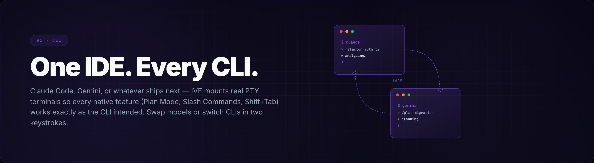

Use **Claude Code**, **Gemini CLI**, or whatever ships next. IVE mounts real PTY terminals so every native feature (Shift+Tab, Plan Mode, Slash Commands) works exactly as the CLI intended. Swap models mid-session or switch CLIs in two keystrokes.

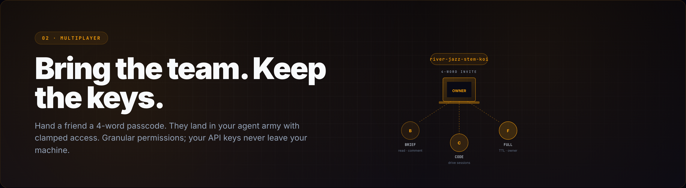

Hand a friend a 4-word passcode. They land in your agent army with clamped access — Brief, Code, or Full. Granular permissions ensure collaborators have exactly what they need; your API keys never leave your machine.

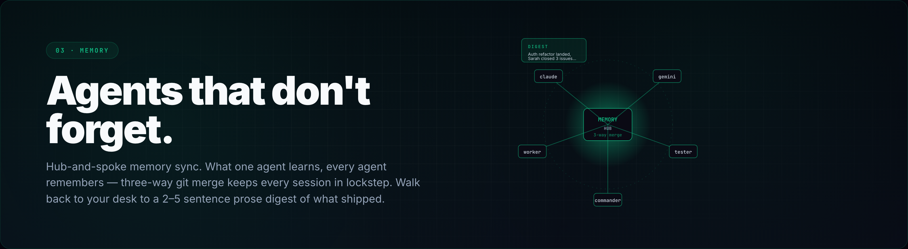

Hub-and-spoke memory sync. What one agent learns, every agent remembers — three-way git merge keeps every session in lockstep. Walk back to your desk to a 2–5 sentence prose digest of what your agents accomplished while you were away.

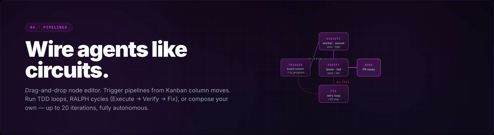

Stop babysitting agents. Use the drag-and-drop node editor to build autonomous workflows. Trigger pipelines from Kanban column moves, run TDD loops, or set up a RALPH (Execute → Verify → Fix) cycle that runs up to 20 iterations automatically.

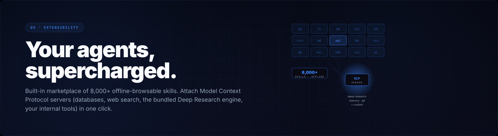

Extensibility is a first-class citizen. IVE ships with a built-in marketplace of 8,000+ offline-browsable skills. Attach Model Context Protocol (MCP) servers (databases, web search, the bundled Deep Research engine, your internal tools) in one click.

---


A walk through what makes IVE different. Each section is a feature you can use today.

---

<a href="https://ive.dev/#orchestration">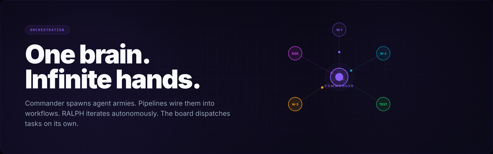</a>

**Stop babysitting agents.** A meta-agent called *Commander* dispatches workers, assigns tickets, and monitors progress. Visual *Pipelines* wire them into autonomous workflows. *RALPH Mode* iterates Execute → Verify → Fix until tests pass. The *Feature Board* auto-dispatches tasks the moment a ticket hits *In Progress*.

`Commander` · `Visual Pipelines` · `RALPH Loop` · `Auto-Dispatch Board`

---

<a href="https://ive.dev/#intelligence">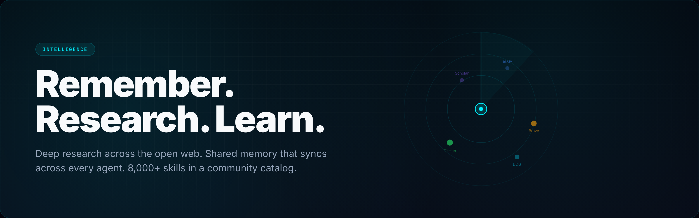</a>

**Agents shouldn't have amnesia.** A self-hosted *Deep Research* engine fans out across DuckDuckGo, arXiv, Semantic Scholar, and GitHub — no API keys required. A hub-and-spoke *Memory* layer keeps every session in sync via three-way git merge. The built-in marketplace ships with 8,000+ skills, browsable offline.

`Deep Research` · `Shared Memory` · `8,000+ Skills` · `MCP Servers`

---

<a href="https://ive.dev/#collaboration">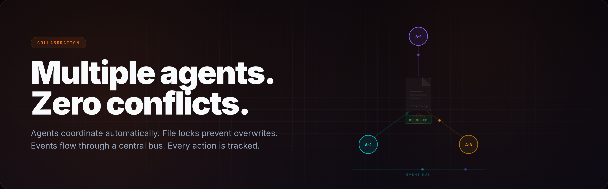</a>

**Two agents, one repo, no chaos.** File-level coordination prevents simultaneous overwrites. A central event bus pipes every tool call, every commit, every pipeline transition through a single audit trail. Workers see each other's intent before they ever touch the same surface.

`File Locks` · `Event Bus` · `Auto-Coordination` · `Full Audit Trail`

---

<a href="https://ive.dev/#multiplayer">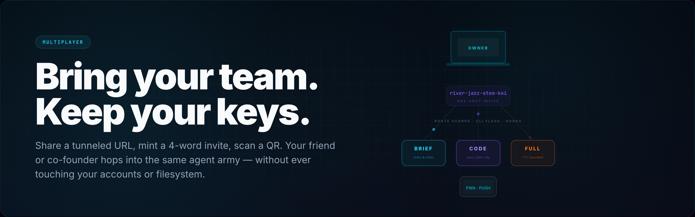</a>

**Hand a friend a 4-word invite.** They land in your agent army with clamped access — *Brief* (read + comment), *Code* (drive sessions, no shell), or *Full* (TTL-bounded owner). Your API keys never leave your machine. Three layers of enforcement: route guards, CLI flag injection, and PreToolUse hooks.

`4-Word Invites` · `QR + PWA` · `Brief · Code · Full` · `Zero Key-Sharing`

---

<a href="https://ive.dev/#catchup">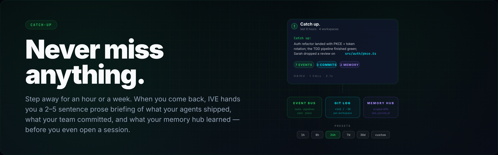</a>

**Step away for an hour. Or a week.** Come back to a 2–5 sentence prose briefing of what your agents shipped, what your team committed, and what your memory hub learned — merged from the event bus, git log, and memory diffs in a single LLM call. The stale-session banner shows up automatically when you've been gone too long.

`Prose Briefings` · `Activity Feed` · `Stale-Session Banner` · `Mode-Aware`

---

<a href="https://ive.dev/#workflows">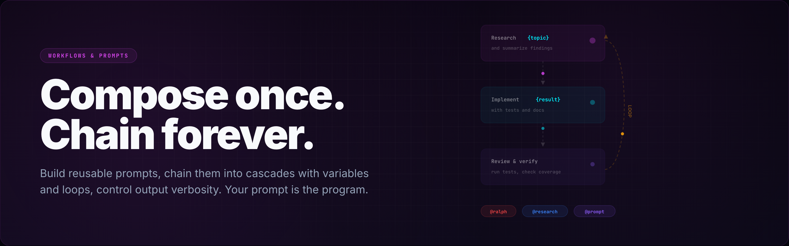</a>

**Your prompt library becomes a programming language.** Save templates with `@prompt:Name` tokens. Chain them into *cascades* with variables, loops, and auto-approval. Dial output verbosity per session with output styles. The same prompt that fixed a bug last Tuesday is one keystroke away today.

`Prompt Library` · `Cascades` · `Loop Support` · `Output Styles`

---

<a href="https://ive.dev/#sessions">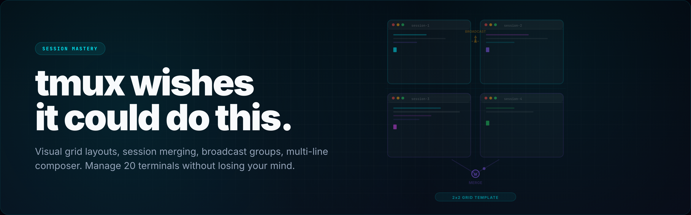</a>

**Twenty terminals, zero panic.** Visual grid layouts that remember themselves. Session merging. Broadcast keystrokes to a group. A multi-line composer with markdown structure for when you need to send something more than `yes`. Tabs stay mounted when you switch — no scroll loss, no state reset.

`Grid Layouts` · `Session Merge` · `Broadcast Groups` · `Composer`

---

<a href="https://ive.dev/#devtools">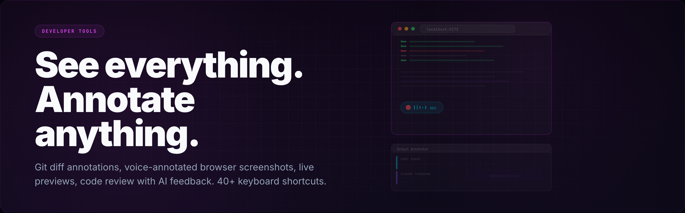</a>

**Code review built in.** Inline git-diff annotations. Voice-narrated browser screenshots. Live previews of your dev server. AI code review on demand. 40+ keyboard shortcuts so your hands never leave the keys.

`Diff Annotations` · `Voice Notes` · `Live Previews` · `40+ Shortcuts`

---

<a href="https://ive.dev/#security">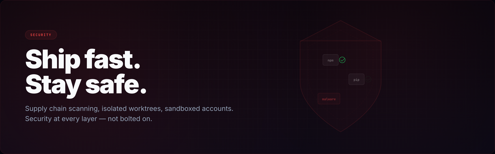</a>

**Defense at every layer, never bolted on.** *Anti-Vibe-Code-Pwner* scans every package install for supply-chain attacks before the agent executes it. Worktrees isolate experiments from your main checkout. Constant-time token comparison, HttpOnly + SameSite cookies, and a strict CSP guard the auth path. Three enforcement layers (route guards, CLI flag injection, PreToolUse hooks) clamp every joiner action.

`AVCP Scanner` · `Isolated Worktrees` · `Constant-Time Auth` · `Defense-in-Depth`

---


* **Backend**: Python (`aiohttp`) spawning real PTY sessions via `os.fork()`. Handles 140+ REST routes and a single multiplexed WebSocket for realtime control.
* **Frontend**: React 19 + Vite 8 + xterm.js. Zustand for state management, styled with Tailwind CSS v4.
* **Data**: Local SQLite (`~/.ive/data.db`). **Zero external cloud dependencies.**
* **Security**: Constant-time token comparisons, HttpOnly + SameSite cookies, strict CSP, and built-in Anti-Vibe-Code-Pwner supply chain scanning.

---


IVE ships with anonymous, local-first telemetry **enabled by default** to help us understand usage during the Alpha phase. We only collect standard metrics (version, platform, session count). **No PII, no code, no prompts are ever collected.**

To opt out:
```bash
IVE_TELEMETRY=off ./start.sh
```

---


We're building the open standard for AI orchestration. Whether it's fixing a bug, adding a new CLI profile, or improving documentation, your contributions are welcome. See [CONTRIBUTING.md](CONTRIBUTING.md) to get started.

<p align="center">
  Built by the IVE community.<br>
  <strong>Stop switching tabs. Start commanding agents.</strong>
</p>
