<p align="center">
  
</p>

<h1 align="center">IVE</h1>

<h3 align="center">Vibecoding on steroids. Humanity's last IDE.</h3>

<p align="center">
  <em>One browser. N terminals. Infinite agents. Bring friends.</em><br>
  <strong>CLI-agnostic · Multiplayer · Skills-extensible · Memory + intelligence built in</strong>
</p>

<p align="center">
  <a href="https://github.com/michael-ra/ive/stargazers"></a>
  <a href="https://github.com/michael-ra/ive/blob/main/LICENSE"></a>
  
  
  
  
  
</p>

<p align="center">
  <a href="https://ive.dev"><strong>🌐 ive.dev</strong></a> ·
  <a href="#-quick-start"><strong>Quick start</strong></a> ·
  <a href="#-what-you-get"><strong>5 pillars</strong></a> ·
  <a href="#-marquee-features"><strong>Marquee</strong></a> ·
  <a href="#-the-full-toolkit"><strong>Full toolkit</strong></a> ·
  <a href="#-why-ive-exists"><strong>Why IVE</strong></a> ·
  <a href="#%EF%B8%8F-under-the-hood"><strong>Architecture</strong></a> ·
  <a href="#%EF%B8%8F-this-is-alpha"><strong>Roadmap</strong></a>
</p>

<h2 align="center">Stop switching tabs. Start commanding agents.</h2>

<p align="center">
  <em>Run 10 Claude Code sessions at once — without losing your mind or your API budget.</em><br>
  <em>Bring your team. Ship <strong>50×</strong> more code in one shared environment — no agent sync drama, no memory drift, no shared keys.</em><br>
  <em>Want the latest from the vibecoding ecosystem? One click installs it.</em><br>
  <em>Realtime collab. The future of startup MVPs — and everything after.</em>
</p>

<p align="center">
  <a href="https://ive.dev">
    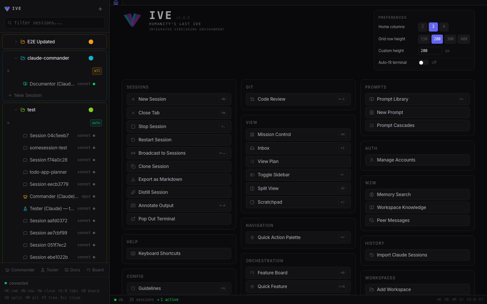
  </a>
</p>
<p align="center"><sub>The IVE main layout — workspaces and sessions on the left, every action one click away. <a href="https://ive.dev"><b>See it on ive.dev →</b></a></sub></p>

<br>

<table>
<tr>
<td align="center" width="33%">
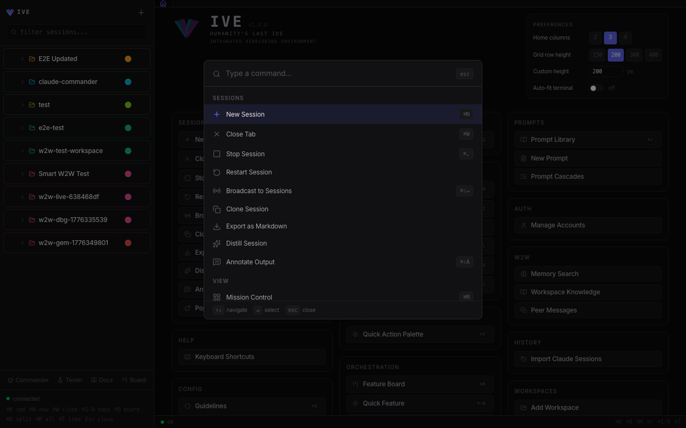
<br><sub><b>⌘K</b> — every action, searchable</sub>
</td>
<td align="center" width="33%">
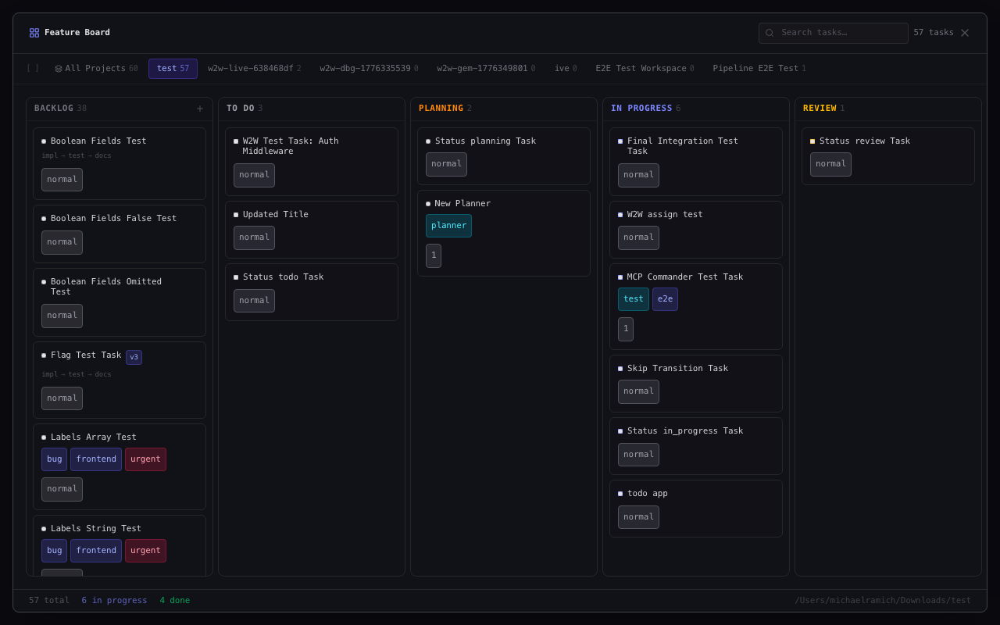
<br><sub><b>Feature Board</b> — pipeline auto-dispatch on column move</sub>
</td>
<td align="center" width="33%">
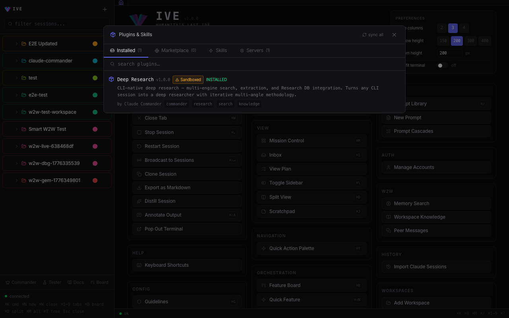
<br><sub><b>Marketplace</b> — 8000+ skills, one-click install</sub>
</td>
</tr>
</table>

<p align="center">
  <strong>140+</strong> API routes&nbsp;·&nbsp;<strong>40+</strong> shortcuts&nbsp;·&nbsp;<strong>35+</strong> MCP tools&nbsp;·&nbsp;<strong>8,000+</strong> skills&nbsp;·&nbsp;<strong>Zero</strong> cloud dependencies
</p>

---

## 🔥 The pitch

Six terminals already running. Three Claude Code, two Gemini, one Commander session managing workers. A friend jumps in from their phone and starts triaging the Feature Board. A pipeline fires the second a ticket hits *In Progress*. Sonnet runs out mid-sentence — IVE grabs the next plan and keeps going. You go get coffee. Nothing stops.

IVE is local and open. Your CLIs, your accounts, your machine. Stack Claude Max + Gemini Ultra + API keys and IVE rotates through them when a quota empties. Invite a collaborator with a four-word passcode, clamp them to read-only or code-only, put the laptop in the bag.

## 🚀 Quick start

```bash
git clone https://github.com/vibe2vibe/ive.git
cd ive
./start.sh
```

Open <http://localhost:5173>. That's it. `start.sh` updates the CLIs, installs everything, pre-fetches Playwright + embedding weights, and launches the backend (`:5111`) and frontend (`:5173`). First run pulls the network; every run after is offline-friendly.

**Don't want to clone?** `npx ive --tunnel` boots a public-tunneled instance you can reach from any device.

Full prerequisites in [`INSTALL.md`](INSTALL.md).

## 📦 What you get

Five promises. Real receipts behind each.

### 1. CLI-agnostic
> Claude Code, Gemini CLI, anything that ships next. One UI, one mental model.

Real PTY terminals — Shift+Tab, plan mode, slash commands, interactive prompts all work exactly like native. Switch CLI mid-session, swap models with resume, spin up a new one in two keystrokes. Haiku, Sonnet, Opus, Gemini Pro and Flash all unified. Adding a new CLI is a one-file profile drop.

<p align="center">
  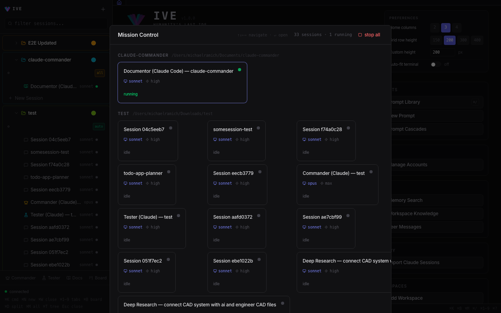
</p>
<p align="center"><sub>Mission Control (⌘M) — every live session across all workspaces in one grid.</sub></p>

### 2. Multiplayer
> Bring your team. Keep your keys. No shared admin password.

Hand a friend a 4-word passcode (or a QR) and they're in. Clamp them to **Brief / Code / Full** — read-only, coding-only, or owner-equivalent — enforced three layers deep so a curious joiner can't escape. Sliding session TTLs, one-click revoke, mode pill in the sidebar. Their keystrokes show up next to yours in real time.

### 3. Skills + extensible
> Plugins, MCP, guidelines, output styles, skills — all live, all swappable mid-flight.

The Marketplace ships with **8,000+ skills** browsable offline. Bring any plugin from the Claude or Gemini ecosystems — IVE auto-detects, translates, and exports back. Three first-party MCP servers (Commander, Worker, Documentor) wire your agents into the app itself. Type `@prompt:` / `@research:` / `@ralph` and watch the token expand inline.

<p align="center">
  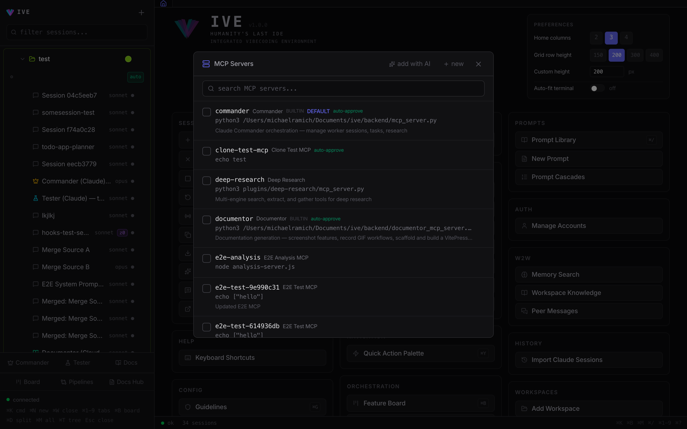
</p>
<p align="center"><sub>⌘⇧S — MCP Servers: register once, attach per session, swap on the fly.</sub></p>

### 4. Memory + intelligence built in
> Hub-and-spoke sync, three-way merge, briefings, an LLM router that uses *your* CLI subscription — no API keys.

Memory entries scoped per-workspace, auto-imported the moment your CLI writes them. Step away for an hour, come back — IVE has written you a 2–5 sentence prose digest of what happened by fusing the event bus, git log, and memory hub. What one agent learns, every agent remembers. Stale-session banner auto-loads at the top of the app when you've been gone > 30 min.

<p align="center">
  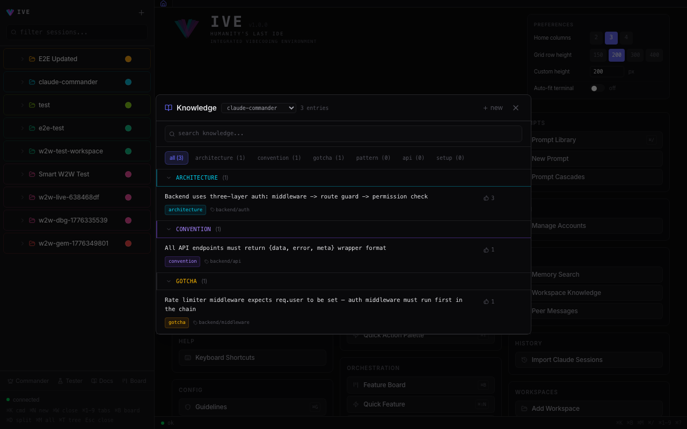
</p>
<p align="center"><sub>Workspace knowledge — memory entries by category (architecture · convention · gotcha · pattern · api · setup), shared across every agent.</sub></p>

### 5. Quality-of-life everywhere
> Everything you wished your terminal had — already inside.

Visual pipeline editor · Feature Board Kanban · Deep Research engine · Mission Control · Code Review · Full-text search across sessions · Live Preview + screenshot annotator · Voice quick-feature drop · Per-terminal scratchpads · 40+ rebindable hotkeys · RALPH execute → verify → fix loops · Token-saving output styles · Mobile-first PWA + Web Push.

<p align="center">
  
</p>
<p align="center"><sub>⌘⇧L — Pipeline Editor: pick a preset (RALPH · Research Loop · Review Loop · TDD Loop · Verification Cascade) or build from scratch.</sub></p>

## 🎯 What changes the moment you install

> The features above are means. These are the ends.

🛑 **Your terminals stop being archaeology.** Every session lives in one grid — state, scroll, name, ownership all tracked. No more *"which window had the auth fix?"*

🛑 **Your tokens stop running out.** Stack every plan you own — Claude Max, Gemini Ultra, API keys. IVE rotates on `quota_exceeded` automatically. You don't notice. The agent doesn't notice. The PR ships.

🛑 **Your laptop stops being a leash.** Add IVE to your phone's home screen. Same agents, same memory, same hotkeys. Code while you're in line for coffee. Triage from the couch. Snack run ≠ context loss.

🛑 **Your team stops needing the keys.** Hand a friend a 4-word invite. They get **Brief / Code / Full** mode — clamped at three layers. No screen sharing. No password reset. No trust fall.

🛑 **Your roadmap stops being yours alone.** Observatory scans the AI ecosystem 24/7 and tells you what to integrate or steal. While you sleep, your project gets smarter.

🛑 **Your context stops getting lost.** Catch-up briefings tell you what your agents (and your collaborators) did while you were gone. In prose. In two clicks.

The vibecoding tax — tab-hunting, manual merging, quota walls, "send me your screen" — **gone.**

## 💡 Why IVE exists

**I was annoyed.**

You're at a hackathon, or shipping fast at a startup, and suddenly there are six terminals open. Code is being pushed faster than you can `git pull`. You're merging, re-syncing, sometimes building the same thing twice in two different windows because nobody knew. You're burning cycles remembering *which* terminal had *which* context. Annotating output, planning, jumping between tasks — all tedious in a stock CLI.

The "solutions" out there? Antigravity, Codex — proprietary boxes. Cursor hasn't moved past the autocomplete era. Nobody's pioneering. So I built the thing I wanted: a paradigm shift, in the open, like the early days.

With IVE you grab a snack at a party and keep coding from your phone — same sessions, same agents, same memory. Stop wasting time. **Spend tokens.** Build your startup before the night's over.

**And never stop coding.** Stack Claude Max plans, Gemini Ultra subs, API accounts — IVE rotates through them automatically when one quota empties, swaps models or accounts *mid-session*, and pools the whole stack across friends working on one project or twenty. Quota-exceeded is a UX problem, not a hard stop.

## 👥 Who it's for

- **Hackathon teams** who need to ship in 36 hours and stop stepping on each other.
- **Solo founders & startup teams** — your product, engineered on autopilot, hands-on, or any blend you dial in. Multiplayer when you bring a co-builder, single-player when you want flow. Every knob configurable. Outpace teams 5× your size.
- **Power users** who already pay for Claude Max + Gemini Ultra and want every token to count.
- **Anyone** who looked at a closed-source AI IDE and thought *"this should be open."*

## ✨ Marquee features

A handful of things IVE does that nothing else in the space does — or at least not all in one place.

### 🔭 Observatory — your project gets smarter while you sleep
A background scanner sweeps **GitHub Trending · Product Hunt · Hacker News · Reddit · X** on a schedule. Two modes per source: **"integrate"** finds tools and libraries worth adding to *this* codebase; **"steal"** finds features competitors shipped that yours should adopt. Every finding gets LLM-scored against your project, then handed to a dedicated **Observatorist** session that tells you exactly what to install, what it replaces, where to put it, and how long it'll take. Hit ⌘⇧O for the feed. Your roadmap, on autopilot.

<p align="center">
  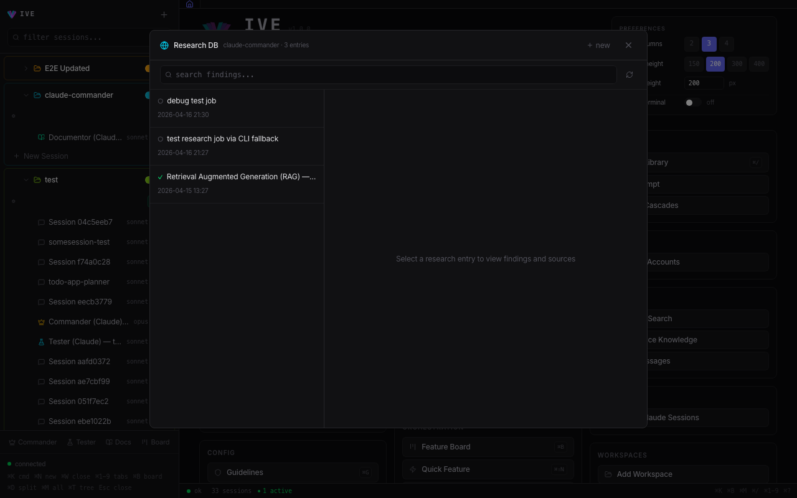
</p>

### 🌊 Pipelines — drag-and-drop multi-agent workflows
A node-graph editor for orchestrating Commander, workers, and testers. **Agent · Condition · Delay** stages connect with `always` / `on_pass` / `on_fail` / `on_match` edges. Triggers fire on Feature Board column moves, on another pipeline finishing, or manually. Task variables auto-inject (`{task_title}`, `{task_criteria}`, `{topic}` …); custom variables prompt a dialog before run. Four presets ship in the box: **Research Loop · TDD Loop · Review Loop · RALPH**. Stages report **structured pass/fail** — no flaky keyword scraping. Concurrency caps and cooldowns keep runaway loops in their cage.

### 📱 Mobile + PWA — code from the couch
Add-to-Home-Screen on iOS and Android. **Web Push** for off-screen alerts when an agent stalls or a pipeline finishes. Pair with `npx ive --tunnel` and you've got a full xterm in your pocket — same sessions, same agents, same memory. Snack run, train ride, line for coffee — your flow doesn't break because your laptop closed.

### 📋 Catch-up briefings — "while you were away"
Step away for an hour. Step back. IVE writes you a **2–5 sentence prose digest** of what happened — agent activity, commits, memory changes — fused from the event bus, your git log, and the memory hub through a small LLM (Haiku by default, swap to Sonnet with a click). A banner auto-loads at the top of the app when you've been idle > 30 min. Pick from preset ranges (1 h / 8 h / 24 h / 7 d / 30 d) or a custom window. Joiners only see what their mode entitles them to.

<p align="center">
  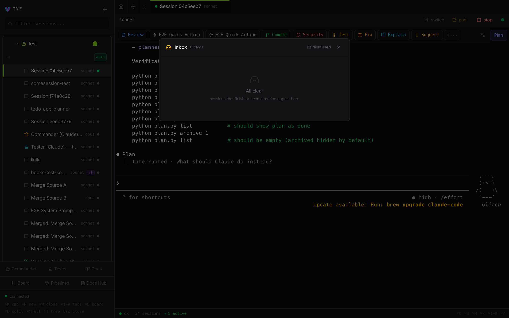
</p>
<p align="center"><sub>⌘I — Inbox: every idle or prompting session, one click away.</sub></p>

### 🔍 Code Review — diffs next to your terminals
A first-class diff viewer: file tree on the left, syntax-highlighted unified diff in the middle, full-text search across hunks, inline annotation. One click opens any file in your IDE. Drives the **Review Loop** pipeline preset directly. ⌘⇧G to open.

### 📓 Scratchpads — three layers, all auto-saved
**⌘J** for a global pad. **Per-session** pad attached to each terminal — context for that agent stays with that agent. **Per-task Excalidraw** drawing surface inside every Feature Board ticket — sketch architecture next to the description. Plus a **Quick Feature drop** (⌘⇧N) with voice input — speak a feature into existence while your hands are full of agents.

<p align="center">
  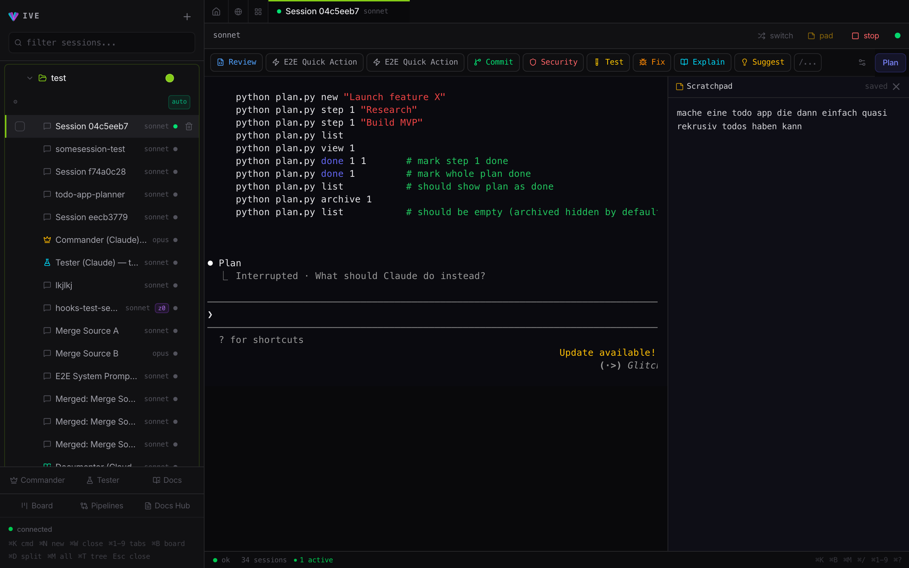
</p>
<p align="center"><sub>Per-session scratchpad — your context for that agent stays attached to that agent.</sub></p>

## 🎒 The full toolkit

The 5 pillars above are the elevator pitch. Here's the inventory.

### 🖥️ Sessions & terminals
- Real PTY for **Claude (Haiku / Sonnet / Opus)** + **Gemini CLI** — Shift+Tab, plan mode, slash commands, interactive prompts all work natively
- 1 MB rolling output cache → instant replay on tab remount or grid switch (no PTY restart, no blank xterm)
- Per-session config: model · permission mode · effort · budget · system prompt · tools · account · worktree
- Switch CLI **mid-session**, switch model with resume, restart with a different account on the fly
- Clone · merge · distill (LLM-summarize) · export to markdown/JSON
- `@prompt:` / `@research:` / `@ralph` token expansion inline as you type
- Composer for structured multi-line input · Force-bar for `Shift+Enter` interrupts
- Broadcast input to many sessions; named broadcast groups
- Mission Control dashboard · Inbox of idle/pending sessions · Sub-agent tree with full transcripts

### 🤖 Agent orchestration
- **Commander** — orchestrates worker sessions through MCP, runs on Opus + plan mode by default
- **Tester** — verifies work via structured pass/fail reporting (no flaky output scraping)
- **Documentor** — auto-builds a docs site for your project: Playwright screenshots, ffmpeg GIFs, VitePress output
- **Worker MCP** — each worker gets scoped tools to read/update its own tasks
- **RALPH** — execute → verify → fix loop, up to 20 iterations, exits when the task says it's done
- **Pipelines** — visual node-graph editor; Agent / Condition / Delay stages; conditional transitions; triggers on board moves, pipeline completions, or manually; concurrency caps + cooldowns
- 4 built-in presets: **Research Loop · TDD Loop · Review Loop · RALPH**
- Task variables auto-inject; custom variables prompt a dialog
- Auto-exec dispatches from Feature Board column moves (and yields to active pipelines)
- Multi-agent conflict detection via **myelin coordination** (experimental)

### 🧠 Knowledge, memory & research
- **Hub-and-spoke memory sync** with three-way merge conflict resolution
- Memory entries scoped per-workspace; globals stay global; auto-import the moment your CLI writes them, with live refresh
- Four memory types: **user / feedback / project / reference**
- **Catch-up briefings** — event bus + git log + memory hub fused into a 2–5 sentence prose digest; Haiku or Sonnet, your pick
- Stale-session banner auto-loads when you've been gone > 30 min
- **Observatory** — autonomous scanner over GitHub Trending · Product Hunt · Hacker News · Reddit · X; "integrate" vs "steal" modes; LLM relevance scoring; dedicated Observatorist session type
- **Self-hosted Deep Research engine** — multi-backend (Brave · SearXNG · DuckDuckGo · arXiv · Semantic Scholar · GitHub), fused ranking, iterative gap analysis, hybrid mode (Claude/Gemini brain + local hands), human-in-the-loop steering
- **Deep Research plugin** with 6 MCP tools: search, extract, gather, save, query, finish
- Distill any session into an LLM summary on demand · Workspace Vision onboarding for new projects

### 👫 Collaboration & multiplayer
- One-shot **invites** in three flavors of the same secret: 4-word speakable passcode · 12-character compact code · QR for in-person handoff
- Three modes — **Brief** (read + advise) · **Code** (auto/plan only, allowlisted shell) · **Full** (owner-equivalent, TTL-bounded)
- Three enforcement layers: route guards · CLI flag clamping · hook-level tool denial — a curious joiner can't escape any of them
- Joiner sessions with sliding TTL and a 90-day hard cap; one-click revoke
- Mode pill in the sidebar with logout
- Tunneled multiplayer mode (`npx ive --tunnel`) with a red-text security banner so nobody forgets the URL is live

### 📱 Mobile, PWA & push
- Add-to-Home-Screen on iOS + Android — full PWA with service worker
- App shell cached for instant loads; live data never cached
- **Web Push** for off-screen alerts when an agent stalls — opt-in, with graceful in-app fallback
- Smart install prompt: iOS instructions for iOS, native install for Android
- Full xterm fidelity in your pocket — same shortcuts, same agents, same memory

<p align="center">
  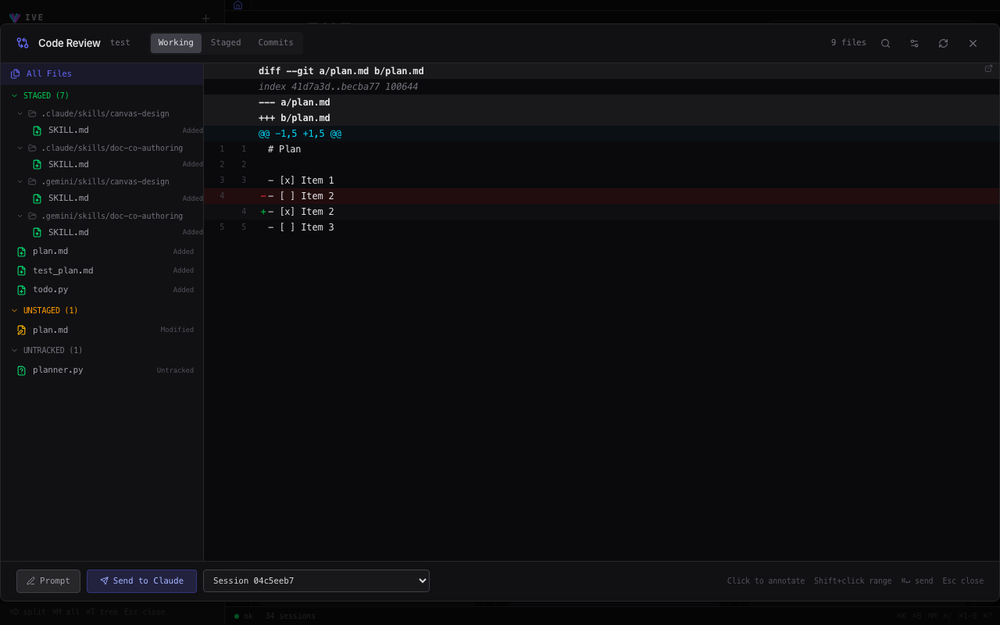
</p>
<p align="center"><sub>⌘⇧G — Code Review: unified diff, file tree, inline annotations, send range to any session.</sub></p>

### 🛠️ Workflow & day-to-day UX
- **Feature Board** Kanban (backlog → todo → planning → in_progress → review → done) with full event history, attachments, and an Excalidraw scratchpad per ticket
- **Quick Feature drop** with voice input — speak a feature into existence
- **Screenshot annotator** — rectangles, arrows, text → send straight to a session
- **Live Preview** — URL input + on-the-fly screenshot capture
- **Code Review** panel — diff with file tree, search, inline annotations, IDE handoff
- Per-terminal scratchpads, auto-saved
- Terminal annotation by ownership (agent vs you), inline @-token chips, paste images from clipboard
- **40+ rebindable hotkeys** · spatial grid navigation (⌃⌥←↑→↓)
- Grid layout templates · session templates · import existing Claude history with one click

### 🧩 Plugins, skills & extensibility
- Plugin Marketplace with multiple registries; one-click install/uninstall
- **Importer** auto-detects Claude plugins, Gemini extensions, standalone skills, and GitHub repos
- **Exporter** translates canonical plugins back into native CLI formats
- LLM-assisted **translator** for edge cases — live-cached docs, confidence scoring, validation loop
- **8,000+ skill catalog baked in** — browse offline
- MCP servers for **Commander · Worker · Documentor**
- **Guidelines** as reusable system-prompt fragments, attachable per session
- **Output Styles** — `lite` / `caveman` / `ultra` / `dense` token-saving modes; cascade session → workspace → global

### 🔐 Security, accounts & supply chain
- **Account auto-rotation** — when one quota empties, IVE swaps to the next account, refreshes its tokens headlessly, and restarts the session 1.5 s later. The agent doesn't notice. The PR ships.
- OAuth **account sandboxing** — separate `HOME` per account so plans never bleed into each other
- Visible browser flow runs the CLI's real `auth login` inside the sandbox — actual OAuth URLs, no fake login pages
- Single auth context for every request; HttpOnly + strict-SameSite cookies; tokens hashed at rest; constant-time comparisons everywhere
- CSP, frame deny, MIME sniff lockdown, Referrer-Policy, Permissions-Policy — set by middleware, not opt-in
- Rate limits on every auth, invite, device-pairing, and push endpoint
- Bundled **Anti-Vibe-Code-Pwner** — supply-chain scanner with a 9-step deep scan per package (npm, pip, GitHub Actions, MCP); intercepts installs *before* they run

### 🔌 Event bus & integrations
- Central event bus: **persist → notify subscribers → broadcast over WebSocket → deliver webhooks**
- Typed events for tasks, sessions, workspaces, plugins, research, captures, MCP tool calls — every state change emits one
- Custom event subscriptions — wire IVE into your own webhooks
- **Hook-based state detection** — structured JSON from your CLI's hooks; no flaky ANSI parsing
- Single multiplexed WebSocket for terminal I/O + control messages

> **By the numbers:** 140+ API routes · 40+ rebindable hotkeys · 35+ MCP tools · 4 pipeline presets · 8,000+ skills · 1 owner, ∞ collaborators.

## 🏗️ Under the hood

- **Backend** — Python aiohttp on `:5111`. 140+ REST routes, one multiplexed WebSocket, real PTYs (full terminal fidelity, not pseudo-emulation).
- **Frontend** — React 19 + Vite 8 + xterm.js on `:5173`. Zustand state, Tailwind v4 dark theme.
- **Data** — SQLite, local. No cloud, no telemetry of your code.
- **Three-layer CLI abstraction** — vocabulary → unified session facade → per-CLI profile. Adding a new CLI is a one-file profile drop.
- **Central event bus** — every state change emits a typed event; subscribers, WebSocket broadcast, and webhooks all branch off the same dispatcher.

## 🛠️ Manual run

```bash
# Backend only
cd backend && python3 server.py

# Frontend only
cd frontend && npm run dev

# Install deps
pip3 install -r backend/requirements.txt
cd frontend && npm install
```

## Telemetry &amp; Privacy

IVE ships with anonymous PostHog telemetry **enabled by default** so the maintainer can see how many installs are active during the beta. Each ping carries a hashed machine id, version string, platform tag, session count, and uptime. **No PII, no prompts, no code.** See [`backend/telemetry.py`](backend/telemetry.py) for the exact payload.

**To opt out**, set the env var before starting:

```bash
IVE_TELEMETRY=off ./start.sh
```

## Contributing

Issues and PRs welcome. See [`CONTRIBUTING.md`](CONTRIBUTING.md) for dev setup, code conventions, and the PR process.

## License

Apache License 2.0 — see [`LICENSE`](LICENSE).

The bundled subprojects (`ext-repo/myelin/`, `anti-vibe-code-pwner/`, `deep_research/`, first-party plugins) carry their own license files where applicable.

---

## ⚠️ This is alpha — and that's the best time to be here

The ground floor of any paradigm shift is rough. Flows will break. Screens will look weird. Agents will say things you didn't ask for. **That's the deal at this stage — and that's exactly why early matters.** This is when contributors leave fingerprints, when "first 100 stars" turns into "shipped feature," when a small group bends an entire category.

The roadmap is loaded: mobile parity, hosted multiplayer, more CLIs (Codex, Aider, Cline, anything next), self-hosted plugin registry, desktop binary, voice-first interactions, deeper Observatory automation, and a lot more.

The proprietary IDEs are racing each other. We're racing for **you**.

> ### ⭐ Star the repo. Be early.
> 🐛 File issues when you hit them. 🛠️ Open PRs when you fix them. 📣 Tell a friend who's outgrown Cursor.
>
> **The next time someone asks how you ship 50× faster — show them IVE.**
>
> **Because IVE done this for YOU.** ❤️
